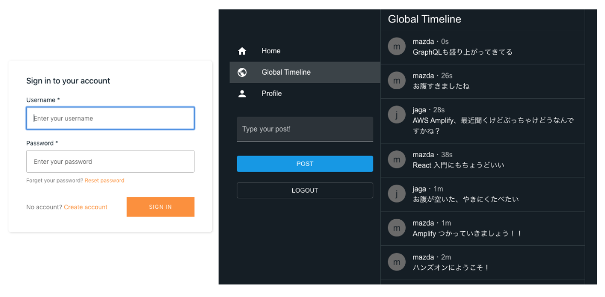

+++
title = "Amplify Social Network App Workshop"
date = 2020-03-18T10:09:42+09:00
weight = 1
+++

Welcome to Amplify Social Network App(or SNS) Workshop! In this workshop, you will learn about AWS Amplify in hands-on way through the development of twitter-like social media applications.

## Audience
- Application developer who wants to develop at explosion speed
- Server-side engineers who want to get started with front-end development

## Overall Workshop 
This workshop assumes the situation by the procurement stage of startups (Seed, Early, Middle/Late, etc.).
This hands-on application can be created as shown in the image below.

### Stage 1 - Seed Stage (Chapter 1 - Chapter 4)
#### Develop the app as the first engineer/CTO of startup!
You are the first developer of startup. You decided to help the CEO develop social media applications, but you only have three days to explain to investors (Pitch/DemoDay). It is enough to implement the minimum required functionality, but you need to launch at the fastest possible time.

#### What you can learn
As you become familiar with the basics of Amplify, you will learn how to use User Authentication, GraphQL to implement timelines, and how to use Amplify Mocking. You will also understand that Amplify not only allows you to implement your application at the fastest time, but also supports future scalability.

### Stage 2 - Early Stage (Chapter 5 - Chapter 6)
#### Acquire a certain number of users and respond to the growing challenges and feature demands!

We implemented and released a minimum of functionality, and succeeded in acquiring a certain number of users. Since it was built with Amplify, it is not necessary to manage servers. However it is necessary to answer the challenges and functional needs that have become clear, such as fixing the validation that was done on the front end and improving searchability.

#### What you can learn
Learn how to incorporate the high searchability of Elasticsearch into applications using GraphQL, and how to enforce input restrictions on the cloud side when using GraphQL.

### Stage 3 - Middle Stage (Chapter 7 - Chapter 8)
#### Businesses are on track and users and engineers are growing rapidly

As a result of continued expansion, the business goes well and at the same time the engineering organization began to expand. As multiple feature developments have progressed in parallel, you need to think about efficient team development.

#### What you can learn

Through the addition of functions, we will learn how to develop a team using multiple Amplify backend environments and build a verification environment for each function using Amplify Console.

## Recommended Environment

- Development Environment
 - "Node.js 10.x/npm 6.x" available for Mac/Windows/Linux
 - The operating environment is checked in v12.16.1/v6.13.4
 - Please note that for Cloud IDEs such as AWS Cloud9, port 20002 is not available during Amplify Mocking.
- Browser environment
 - Google Chrome (most recent 2 versions)
 - Mozilla Firefox (most recent 2 versions)
 - Internet Explorer v11
 - Microsoft Edge (most recent 2 versions)